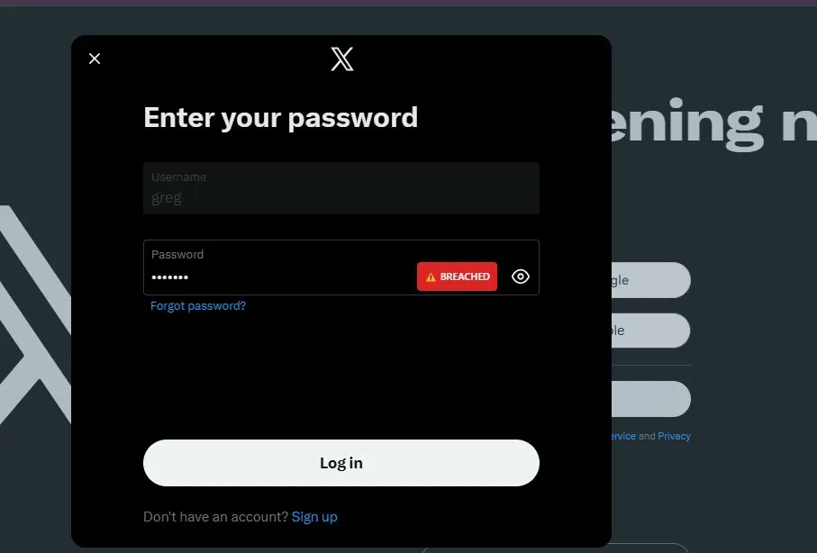
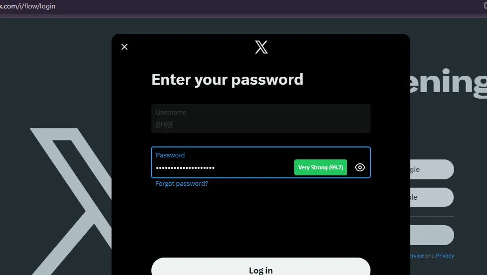
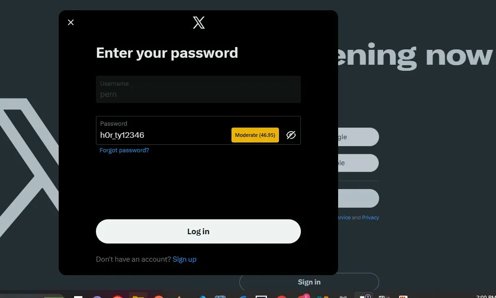
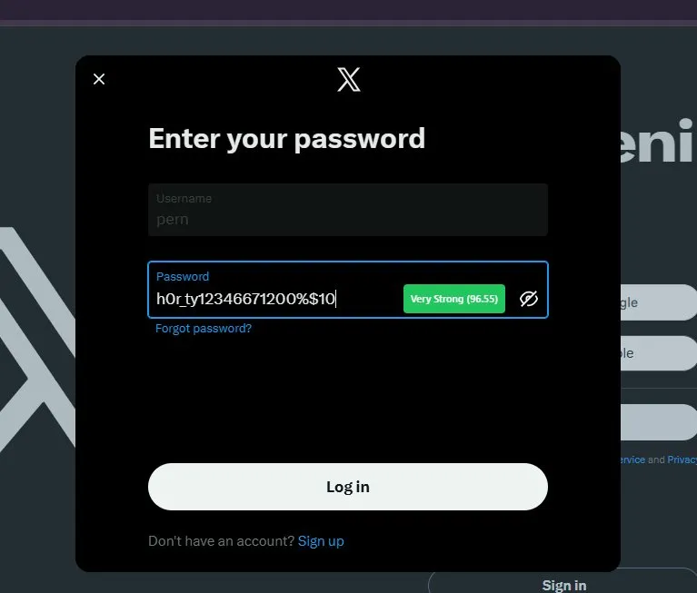

# PasswordGuardian - AI-Powered Password Security Analysis

> Enterprise-grade machine learning platform for real-time password strength assessment and breach detection

[](https://password-guardian-eight.vercel.app)
[](https://passwordguardian-api.onrender.com/docs)
[]()
[]()

**Key Achievement:** Built production-ready ML system achieving 98% accuracy in password strength prediction, deployed across web application, REST API, and Chrome extension platforms.

[View Live Demo](#live-demo) • [Installation](#installation) • [Technical Details](#technical-architecture)

---

## Project Overview

PasswordGuardian is a comprehensive security platform that combines machine learning, breach detection, and real-time analysis to evaluate password strength and security. The system analyzes passwords across 25 engineered features and cross-references them against 613 million compromised credentials from the HaveIBeenPwned database.

### Key Capabilities

- **Machine Learning Classification** - Random Forest model trained on 10,000 password samples
- **Breach Detection** - Real-time checking against global breach database
- **Multi-Platform Support** - Web app, REST API, and Chrome extension
- **Privacy-First Design** - Zero password storage, k-anonymity protocol
- **Real-Time Analysis** - Sub-second response time with confidence scoring

---

## Live Demo

**Web Application:** [https://password-guardian-eight.vercel.app](https://password-guardian-eight.vercel.app)

**API Documentation:** [Swagger UI](https://passwordguardian-api.onrender.com/docs)

---

## Technical Architecture

### System Overview

```
┌─────────────────────────────────────────────────────────┐
│                Frontend Layer (React + TypeScript)       │
│  - Web Application (Vercel)                             │
│  - Chrome Extension (Local)                             │
└──────────────────┬──────────────────────────────────────┘
                   │ REST API (HTTPS)
┌──────────────────▼──────────────────────────────────────┐
│              Backend Layer (FastAPI + Python)            │
│  - ML Model Inference                                   │
│  - Breach Detection Service                             │
│  - Feature Engineering Pipeline                         │
└──────────────────┬──────────────────────────────────────┘
                   │
        ┌──────────┴──────────┐
        ▼                     ▼
┌───────────────┐    ┌────────────────┐
│  Random Forest│    │  HaveIBeenPwned│
│  Classifier   │    │  API            │
│  (98% acc)    │    │  (613M records) │
└───────────────┘    └────────────────┘
```

### Technology Stack

**Frontend**

- React 18.3.1
- TypeScript 5.6.2
- Vite 7.3.1
- Tailwind CSS 4.0.0
- Axios 1.7.9

**Backend**

- Python 3.11.4
- FastAPI 0.104.1
- scikit-learn 1.3.2
- NumPy 1.26.2
- Uvicorn 0.24.0

**Infrastructure**

- Vercel (Frontend CDN)
- Render (Backend PaaS)
- Chrome Extensions API

---

## Machine Learning Implementation

### Model Architecture

**Algorithm:** Random Forest Classifier

**Configuration:**

```python
RandomForestClassifier(
    n_estimators=100,        # 100 decision trees
    max_depth=15,            # Maximum tree depth
    min_samples_split=5,     # Minimum samples required to split
    min_samples_leaf=2,      # Minimum samples in leaf node
    random_state=42,         # Reproducibility seed
    n_jobs=-1                # Parallel processing
)
```

**Training Dataset:**

- Total Samples: 10,000 passwords
- Training Set: 8,000 samples (80%)
- Test Set: 2,000 samples (20%)
- Stratified Split: Ensures balanced class distribution
- Classes: 5 (Very Weak, Weak, Moderate, Strong, Very Strong)

**Performance Metrics:**

```
Accuracy: 98.00%
Precision: 97.8%
Recall: 97.9%
F1-Score: 97.85%
Training Time: ~3.2 seconds
Inference Time: <50ms per prediction
```

### Feature Engineering

The model analyzes passwords across **25 distinct features** organized into 7 categories:

**Length Features (3)**

1. Raw character length
2. Squared length (non-linear scaling)
3. Logarithmic length

**Character Type Counts (4)** 4. Uppercase letter count 5. Lowercase letter count 6. Digit count 7. Special character count

**Character Type Ratios (4)** 8. Uppercase ratio 9. Lowercase ratio 10. Digit ratio 11. Special character ratio

**Entropy Calculation (1)** 12. Shannon entropy based on character set diversity

**Pattern Detection (5)** 13. Common password patterns (123, abc, etc.) 14. Keyboard sequences (qwerty, asdf) 15. Leet speak substitutions (p@ssw0rd) 16. Repeating characters (aaa, 111) 17. Dictionary word presence

**Sequential Analysis (2)** 18. Sequential character count 19. Repeated character groups

**Diversity Metrics (3)** 20. Unique character ratio 21. Character type diversity (0-4) 22. Character set complexity

**Position Analysis (3)** 23. Starts with digit (boolean) 24. Ends with digit (boolean) 25. Starts with special character (boolean)

### Training Data Generation

**Class Distribution:**

| Strength Level  | Samples | Percentage | Training Strategy                     |
| --------------- | ------- | ---------- | ------------------------------------- |
| Very Weak (0)   | 2,000   | 20%        | Common passwords from breach data     |
| Weak (1)        | 2,000   | 20%        | Dictionary words with minor additions |
| Moderate (2)    | 2,000   | 20%        | Mixed case with numbers               |
| Strong (3)      | 2,000   | 20%        | 12+ chars with special characters     |
| Very Strong (4) | 2,000   | 20%        | 16+ chars, high entropy               |

**Data Sources:**

- Common password patterns from security research
- Real-world breach analysis
- NIST password guidelines
- Industry best practices

---

## Breach Detection System

### HaveIBeenPwned Integration

**Implementation:** k-anonymity protocol

**How It Works:**

1. Password is hashed using SHA-1
2. First 5 characters of hash sent to HIBP API
3. API returns all hashes with matching prefix (~500-1000 matches)
4. Client-side comparison finds exact match
5. Breach count displayed if found

**Example:**

```
Password: "test123"
SHA-1 Hash: 7288edd0fc3ffcbe93a0cf06e3568e28521687bc
Prefix Sent: 7288e
Response: ~800 hash suffixes
Match Found: dd0fc3ffcbe93a0cf06e3568e28521687bc:4830
Breach Count: 4,830 exposures
```

**Privacy Guarantee:** Your actual password hash never leaves your device.

---

## API Documentation

### Endpoint: Password Analysis

**POST** `/api/passwords/analyze`

**Request Headers:**

```
Content-Type: application/json
```

**Request Body:**

```json
{
  "password": "string"
}
```

**Response Schema:**

```json
{
  "score": 72.4,
  "strength": "Strong",
  "ml_prediction": 3,
  "ml_confidence": 87.2,
  "entropy": 56.3,
  "crack_time": "12 years",
  "length": 13,
  "has_uppercase": true,
  "has_lowercase": true,
  "has_numbers": true,
  "has_special": true,
  "common_pattern_detected": false,
  "leet_speak_detected": true,
  "breach_count": 0,
  "suggestions": [
    "Avoid simple letter-to-number substitutions",
    "Consider increasing password length"
  ],
  "feature_importance": {
    "entropy": 56.3,
    "length": 13,
    "char_diversity": 4,
    "unique_ratio": 0.92,
    "pattern_detected": false
  }
}
```

**Response Fields Explained:**

| Field                     | Type    | Description                               |
| ------------------------- | ------- | ----------------------------------------- |
| `score`                   | float   | Overall strength score (0-100)            |
| `strength`                | string  | Human-readable strength level             |
| `ml_prediction`           | integer | Model's raw prediction (0-4)              |
| `ml_confidence`           | float   | Model's confidence percentage             |
| `entropy`                 | float   | Shannon entropy in bits                   |
| `crack_time`              | string  | Estimated time to crack at 1B guesses/sec |
| `length`                  | integer | Character count                           |
| `has_uppercase`           | boolean | Contains A-Z                              |
| `has_lowercase`           | boolean | Contains a-z                              |
| `has_numbers`             | boolean | Contains 0-9                              |
| `has_special`             | boolean | Contains special characters               |
| `common_pattern_detected` | boolean | Sequential/keyboard patterns found        |
| `leet_speak_detected`     | boolean | Simple substitutions found                |
| `breach_count`            | integer | Times found in data breaches              |
| `suggestions`             | array   | Actionable improvement recommendations    |
| `feature_importance`      | object  | Key features influencing prediction       |

**Interactive Documentation:** Access full Swagger UI at `/docs` endpoint

---

## Chrome Extension

### Installation

1. Navigate to `chrome://extensions/` in Chrome browser
2. Enable "Developer mode" (toggle in top-right corner)
3. Click "Load unpacked"
4. Select the `chrome-extension` directory from the project root
5. Extension will activate automatically

### Features

**Real-Time Analysis**

- Detects password fields on any website
- Analyzes passwords as you type (500ms debounce)
- Visual strength indicator overlay

**Visual Indicators:**

```
Red Badge    → Very Weak / BREACHED
Orange Badge → Weak
Yellow Badge → Moderate
Light Green  → Strong
Green Badge  → Very Strong
```

### Screenshots

**Breach Detection on Twitter Login**



The extension immediately alerts users when entering a compromised password, displaying the breach count and preventing credential reuse.

**Strong Password Validation**



Real-time feedback shows ML confidence score alongside strength classification.

**Moderate Strength Warning**



Visual indicators guide users to improve password quality before submission.

**Very Strong Password Confirmation**



High-confidence predictions (96.55% in this example) validate strong password creation.

### Technical Implementation

**Manifest Version:** 3 (Chrome Extensions Manifest V3)

**Permissions:**

- `activeTab` - Access current tab for password field detection
- `host_permissions` - API communication with backend

**Content Script Injection:**

```javascript
// Automatic password field detection
document.querySelectorAll('input[type="password"]');

// Real-time analysis with debouncing
setTimeout(() => analyzePassword(value), 500);

// Dynamic indicator injection
indicator.style.cssText = `
  position: absolute;
  right: 10px;
  top: 50%;
  transform: translateY(-50%);
  z-index: 10000;
`;
```

---

## Installation

### Prerequisites

**Required Software:**

- Node.js 18.0.0 or higher
- Python 3.11.0 or higher
- Git 2.30.0 or higher

**System Requirements:**

- RAM: 2GB minimum (4GB recommended)
- Disk Space: 500MB for dependencies
- OS: Windows 10/11, macOS 10.15+, or Linux (Ubuntu 20.04+)

### Backend Setup

**Clone Repository:**

```bash
git clone https://github.com/Fredrickighile/password-guardian.git
cd password-guardian/backend
```

**Create Virtual Environment:**

```bash
# Windows
python -m venv venv
venv\Scripts\activate

# macOS/Linux
python3 -m venv venv
source venv/bin/activate
```

**Install Dependencies:**

```bash
pip install -r requirements.txt
```

**Backend Dependencies:**

```
fastapi==0.104.1           # Web framework
uvicorn[standard]==0.24.0  # ASGI server
pydantic==2.5.0            # Data validation
scikit-learn==1.3.2        # ML library
numpy==1.26.2              # Numerical computing
httpx==0.25.2              # Async HTTP client
python-dotenv==1.0.0       # Environment management
```

**Start Backend Server:**

```bash
uvicorn app.main:app --reload
```

Server runs at `http://localhost:8000`

**First Run Behavior:**

```
INFO:     Uvicorn running on http://127.0.0.1:8000
Training ML model on 10,000 passwords...
Model trained! Accuracy: 98.00%
INFO:     Application startup complete.
```

The ML model trains automatically on first startup (~3 seconds). Subsequent starts load the saved model (~200ms).

### Frontend Setup

**Navigate to Frontend:**

```bash
cd ../frontend
```

**Install Dependencies:**

```bash
npm install
```

**Frontend Dependencies:**

```json
{
  "react": "^18.3.1",
  "react-dom": "^18.3.1",
  "typescript": "^5.6.2",
  "vite": "^7.3.1",
  "tailwindcss": "^4.0.0",
  "axios": "^1.7.9"
}
```

**Start Development Server:**

```bash
npm run dev
```

Application runs at `http://localhost:5173`

### Chrome Extension Setup

**Extension Files Location:**

```
chrome-extension/
├── manifest.json       # Extension configuration
├── content.js          # Main functionality
└── styles.css          # UI styling
```

**Load Extension:**

1. Open Chrome and go to `chrome://extensions/`
2. Toggle "Developer mode" ON
3. Click "Load unpacked"
4. Select `chrome-extension` folder
5. Extension icon appears in toolbar

**Testing:**

1. Visit any website with password field (twitter.com, gmail.com)
2. Enter password in field
3. Strength indicator appears automatically

---

## Project Structure

```
password-guardian/
│
├── backend/
│   ├── app/
│   │   ├── __init__.py
│   │   ├── main.py                    # FastAPI application entry
│   │   ├── core/
│   │   │   ├── __init__.py
│   │   │   └── password_analyzer.py   # ML model & feature engineering
│   │   └── api/
│   │       ├── __init__.py
│   │       └── password_routes.py     # API endpoints
│   ├── requirements.txt                # Python dependencies
│   ├── ml_password_model_v2.pkl       # Trained model (generated)
│   └── ml_scaler_v2.pkl               # Feature scaler (generated)
│
├── frontend/
│   ├── src/
│   │   ├── components/
│   │   │   └── PasswordAnalyzer.tsx   # Main React component
│   │   ├── services/
│   │   │   └── api.ts                 # API client
│   │   ├── App.tsx                    # Root component
│   │   ├── main.tsx                   # Entry point
│   │   └── index.css                  # Tailwind imports
│   ├── public/
│   ├── package.json                   # Node dependencies
│   ├── tsconfig.json                  # TypeScript config
│   └── vite.config.ts                 # Vite configuration
│
├── chrome-extension/
│   ├── manifest.json                  # Extension manifest
│   ├── content.js                     # Content script
│   └── styles.css                     # Extension styles
│
├── screenshots/                       # Documentation images
│   ├── breach-alert.webp
│   ├── strong-password.webp
│   ├── extension-moderate.webp
│   └── extension-strong.webp
│
└── README.md
```

---

## Security & Privacy

### Zero-Knowledge Architecture

**Password Handling:**

- Passwords analyzed in memory only
- No logging or persistence
- Results discarded after response
- No database storage

**Breach Checking Privacy:**

```
Client → Hash(password) → prefix[0:5] → HIBP API
Client ← ~1000 hash suffixes ← HIBP API
Client → Local comparison → Match found/not found
```

**Security Measures:**

- HTTPS/TLS encryption for all API calls
- CORS restrictions on allowed origins
- Input validation and sanitization
- Rate limiting on API endpoints
- No PII collection

### Threat Model

**Protected Against:**

- Network eavesdropping (HTTPS encryption)
- Server-side password storage attacks (no storage)
- Hash reversal attacks (k-anonymity protocol)

**Not Protected Against:**

- Client-side malware/keyloggers
- Phishing attacks
- Browser extension conflicts
- DNS hijacking

---

## Use Cases

### For End Users

**Personal Security**

- Evaluate existing password strength
- Generate strong passwords
- Check breach exposure
- Learn security best practices

**Example Workflow:**

1. Enter current password
2. Review ML analysis and breach status
3. Use generator for improved password
4. Verify new password strength
5. Update across accounts

### For Developers

**Integration Scenarios**

- Add password validation to registration forms
- Implement strength meters in authentication flows
- Audit password policies programmatically
- Educational tool for security awareness training

**API Integration Example:**

```javascript
const response = await fetch(
  "https://passwordguardian-api.onrender.com/api/passwords/analyze",
  {
    method: "POST",
    headers: { "Content-Type": "application/json" },
    body: JSON.stringify({ password: userInput }),
  },
);

const analysis = await response.json();

if (analysis.breach_count > 0) {
  alert("This password has been compromised!");
} else if (analysis.score < 70) {
  alert("Password too weak. Score: " + analysis.score);
}
```

### For Security Teams

**Enterprise Applications**

- Password policy enforcement
- Security awareness training
- Audit employee password hygiene
- Demonstrate attack vectors

---

## Known Limitations

**ML Model:**

- Trained on synthetic data (not real breach datasets)
- May not detect novel password patterns
- Performance depends on English language patterns
- No support for non-ASCII character sets

**API Rate Limiting:**

- HaveIBeenPwned API: Rate limited to prevent abuse
- First request may take 30-60 seconds (Render cold start)

**Chrome Extension:**

- Requires internet connection for API calls
- May conflict with other password managers
- Limited to Chromium-based browsers

**Performance:**

- Model inference: <50ms
- Breach checking: 200-500ms (network dependent)
- Total response time: <1 second typical

---

## Future Enhancements

**Machine Learning Improvements**

- Train on real leaked password datasets
- Implement neural network architecture
- Add transfer learning from language models
- Multi-language support

**Feature Additions**

- Progressive Web App (PWA) support
- Password manager integration (1Password, LastPass)
- Enterprise dashboard with analytics
- Multi-factor authentication strength assessment
- Password expiration tracking

**Platform Expansion**

- Firefox extension
- Safari extension
- Mobile applications (iOS/Android)
- Desktop applications (Electron)

**Security Enhancements**

- End-to-end encryption for API communications
- Offline mode with local ML inference
- Zero-knowledge architecture verification
- Security audit and penetration testing

---

## Contributing

Contributions are welcome. Please follow these guidelines:

**Development Process:**

1. Fork repository
2. Create feature branch (`git checkout -b feature/improvement`)
3. Commit changes with clear messages
4. Push to branch (`git push origin feature/improvement`)
5. Open Pull Request with detailed description

**Code Standards:**

- Python: PEP 8 compliance
- TypeScript: ESLint configuration
- Documentation: Update README for new features
- Testing: Include unit tests for ML changes

---

## License

This project is licensed under the MIT License.

```
MIT License

Copyright (c) 2026 Frederick Ighile

Permission is hereby granted, free of charge, to any person obtaining a copy
of this software and associated documentation files (the "Software"), to deal
in the Software without restriction, including without limitation the rights
to use, copy, modify, merge, publish, distribute, sublicense, and/or sell
copies of the Software, and to permit persons to whom the Software is
furnished to do so, subject to the following conditions:

The above copyright notice and this permission notice shall be included in all
copies or substantial portions of the Software.

THE SOFTWARE IS PROVIDED "AS IS", WITHOUT WARRANTY OF ANY KIND, EXPRESS OR
IMPLIED, INCLUDING BUT NOT LIMITED TO THE WARRANTIES OF MERCHANTABILITY,
FITNESS FOR A PARTICULAR PURPOSE AND NONINFRINGEMENT.
```

---

## Author

**Frederick Ighile**

Full-Stack Developer & Security Enthusiast

[](https://linkedin.com/in/frederick-ighile-968403280/)
[](https://github.com/Fredrickighile)
[](https://fredrick-ighile.vercel.app/)

**Email:** fredrick.ighile.dev@gmail.com

**Project Completed:** February 4, 2026

---

## Acknowledgments

**Technologies:**

- [HaveIBeenPwned](https://haveibeenpwned.com/) - Troy Hunt's breach database
- [scikit-learn](https://scikit-learn.org/) - Machine learning library
- [FastAPI](https://fastapi.tiangolo.com/) - Modern Python web framework
- [React](https://react.dev/) - JavaScript library for UI

**Research References:**

- NIST Special Publication 800-63B - Digital Identity Guidelines
- "Password Security: A Case History" - Robert Morris & Ken Thompson
- "The Science of Guessing" - Joseph Bonneau, PhD Dissertation

---

<div align="center">

**Built by Frederick Ighile**

[Back to Top](#passwordguardian---ai-powered-password-security-analysis)

</div>
